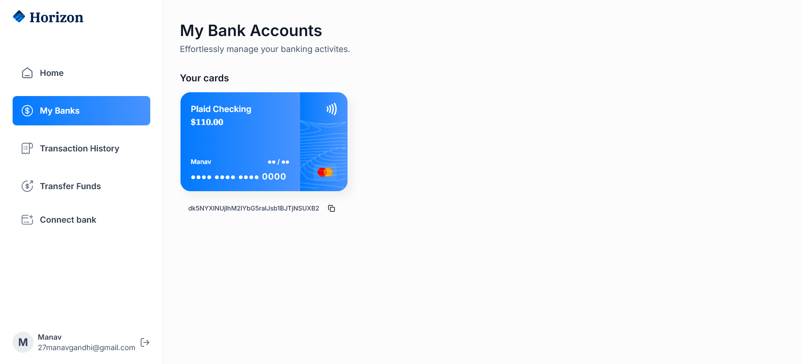

# 🏦 Banking Web App

<div align="center">
  
  
  
  
  
  
</div>

<div align="center">
  <h3>🚀 A Modern Fintech Banking Application</h3>
  <p><strong>Engineered a finance management dashboard using React for transaction tracking, budgeting, and user-level reporting.</strong></p>
</div>

---

## 📋 Table of Contents

1. [🤖 Introduction](#introduction)
2. [⚙️ Tech Stack](#tech-stack)
3. [🔋 Features](#features)
4. [🤸 Quick Start](#quick-start)
5. [🔐 Authentication](#authentication)
6. [📱 Screenshots](#screenshots)
7. [🤝 Contributing](#contributing)
8. [📄 License](#license)

## 🤖 Introduction

**Banking Web App** is a comprehensive financial SaaS platform built with Next.js that revolutionizes personal finance management. The application seamlessly connects to multiple bank accounts through secure APIs, providing real-time transaction monitoring, fund transfers, and comprehensive financial analytics.

### 🌟 Key Highlights
- **Multi-Bank Integration**: Connect and manage multiple bank accounts in one place
- **Real-Time Synchronization**: Live transaction updates and balance monitoring
- **Secure Transfers**: Safe money transfers between platform users
- **Financial Analytics**: Advanced budgeting and spending insights
- **Enterprise-Grade Security**: Bank-level security with SSR authentication

## ⚙️ Tech Stack

- **Frontend Framework**: Next.js 14 with TypeScript
- **Styling**: Tailwind CSS
- **Backend Services**: Appwrite (Database & Authentication)
- **Banking APIs**: Plaid (Account linking & Transaction data)
- **Payment Processing**: Dwolla (Money transfers)
- **Form Management**: React Hook Form with Zod validation
- **Charts & Analytics**: Chart.js
- **UI Components**: ShadCN/UI

## 🔋 Features

### 🔐 **Ultra-Secure Authentication**
- Server-side rendering (SSR) authentication
- Advanced validation and authorization
- Session management with secure cookies

### 🏦 **Multi-Bank Account Integration**
- Connect multiple bank accounts via Plaid
- Real-time account balance synchronization
- Comprehensive account details and management

### 📊 **Smart Dashboard**
- Overview of total balance across all connected banks
- Recent transaction history
- Category-wise spending analysis
- Visual spending insights with charts

### 💰 **Transaction Management**
- Complete transaction history with pagination
- Advanced filtering options by bank, date, and category
- Real-time transaction updates

### 💸 **Secure Fund Transfers**
- Transfer money between platform users
- Dwolla integration for secure payments
- Required recipient verification
- Transfer history and tracking

### 📱 **Responsive Design**
- Seamless experience across desktop, tablet, and mobile
- Modern UI with Tailwind CSS
- Optimized performance and accessibility

## 🤸 Quick Start

### Prerequisites

Ensure you have the following installed:
- [Git](https://git-scm.com/)
- [Node.js](https://nodejs.org/en) (v18 or higher)
- [npm](https://www.npmjs.com/) or [yarn](https://yarnpkg.com/)

### Installation

1. **Clone the repository**
   ```bash
   git clone [YOUR_GITHUB_REPO_URL]
   cd banking-web-app
   ```

2. **Install dependencies**
   ```bash
   npm install
   # or
   yarn install
   ```

3. **Environment Setup**
   
   Create a `.env` file in the root directory and add the following variables:

   ```env
   # NEXT.JS
   NEXT_PUBLIC_SITE_URL=http://localhost:3000

   # APPWRITE CONFIGURATION
   NEXT_PUBLIC_APPWRITE_ENDPOINT=https://cloud.appwrite.io/v1
   NEXT_PUBLIC_APPWRITE_PROJECT=your_appwrite_project_id
   APPWRITE_DATABASE_ID=your_database_id
   APPWRITE_USER_COLLECTION_ID=your_user_collection_id
   APPWRITE_ITEM_COLLECTION_ID=your_item_collection_id
   APPWRITE_BANK_COLLECTION_ID=your_bank_collection_id
   APPWRITE_TRANSACTION_COLLECTION_ID=your_transaction_collection_id
   NEXT_APPWRITE_KEY=your_appwrite_api_key

   # PLAID CONFIGURATION
   PLAID_CLIENT_ID=your_plaid_client_id
   PLAID_SECRET=your_plaid_secret_key
   PLAID_ENV=sandbox
   PLAID_PRODUCTS=auth,transactions,identity
   PLAID_COUNTRY_CODES=US,CA

   # DWOLLA CONFIGURATION
   DWOLLA_KEY=your_dwolla_key
   DWOLLA_SECRET=your_dwolla_secret
   DWOLLA_BASE_URL=https://api-sandbox.dwolla.com
   DWOLLA_ENV=sandbox
   ```

4. **Get API Credentials**
   - **Appwrite**: Sign up at [Appwrite](https://appwrite.io/) and create a new project
   - **Plaid**: Register at [Plaid](https://plaid.com/) for banking API access
   - **Dwolla**: Create account at [Dwolla](https://www.dwolla.com/) for payment processing

5. **Run the development server**
   ```bash
   npm run dev
   # or
   yarn dev
   ```

6. **Open your browser**
   Navigate to [http://localhost:3000](http://localhost:3000) to view the application.

## 🔐 Authentication

### Demo Account Access

For testing purposes, when connecting a bank account:

1. **Choose any bank** from the Plaid connection interface
2. **When prompted for credentials, use:**
   - **Username**: `user_good`
   - **Password**: `pass_good`

> **Note**: These are Plaid sandbox credentials for demonstration purposes only.

## 📱 Screenshots





## 🚀 Deployment

This application can be deployed on various platforms:

- **Vercel** (Recommended for Next.js)
- **Netlify**
- **Railway**
- **Heroku**

Make sure to set up all environment variables in your deployment platform.

## 🤝 Contributing

Contributions are welcome! Please feel free to submit a Pull Request.

1. Fork the project
2. Create your feature branch (`git checkout -b feature/AmazingFeature`)
3. Commit your changes (`git commit -m 'Add some AmazingFeature'`)
4. Push to the branch (`git push origin feature/AmazingFeature`)
5. Open a Pull Request

## 📄 License

This project is licensed under the MIT License - see the [LICENSE](LICENSE) file for details.

---

<div align="center">
  <p>⭐ Star this repository if you found it helpful!</p>
  <p>Made with ❤️ by Manav Gandhi</p>
</div>